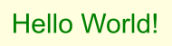
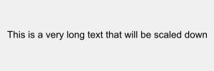
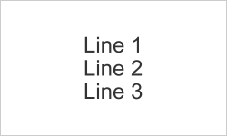

# text2png

Convert text to PNG images with optional fixed dimensions and auto-scaling.

## Installation

```bash
npm install @igxjs/text2png
```

**Requirements:** [node-canvas](https://github.com/Automattic/node-canvas) (see [installation guide](https://github.com/Automattic/node-canvas/wiki))

## Quick Start

```js
const fs = require('fs');
const text2png = require('@igxjs/text2png');

// Basic usage
fs.writeFileSync('output.png', text2png('Hello World!'));

// With styling
fs.writeFileSync('styled.png', text2png('Hello!', {
  font: '40px Arial',
  color: 'blue',
  backgroundColor: 'white',
  padding: 20
}));

// Fixed size (great for avatars!)
fs.writeFileSync('avatar.png', text2png('IGX', {
  width: 200,
  height: 200,
  font: '80px Arial',
  textColor: 'white',
  backgroundColor: '#4F46E5',
  textAlign: 'center',
  verticalAlign: 'middle'
}));
```

## API

### `text2png(text, options)`

#### Options

| Option | Type | Default | Description |
|--------|------|---------|-------------|
| **Text Styling** |
| `font` | string | `'30px sans-serif'` | CSS font string |
| `color` / `textColor` | string | `'black'` | Text color (any CSS color) |
| `textAlign` | string | `'left'` | Horizontal alignment: `'left'`, `'center'`, `'right'` |
| `strokeWidth` | number | `0` | Text stroke/outline width |
| `strokeColor` | string | `'white'` | Text stroke color |
| **Background & Spacing** |
| `backgroundColor` / `bgColor` | string | `transparent` | Background color |
| `padding` | number | `0` | Padding on all sides |
| `paddingLeft/Right/Top/Bottom` | number | `0` | Individual side padding |
| `lineSpacing` | number | `0` | Extra spacing between lines |
| **Border** |
| `borderWidth` | number | `0` | Border width on all sides |
| `borderLeft/Right/Top/BottomWidth` | number | `0` | Individual border widths |
| `borderColor` | string | `'black'` | Border color |
| **Fixed Dimensions** ⭐ |
| `width` | number | `null` | Fixed width (auto-scales content to fit) |
| `height` | number | `null` | Fixed height (auto-scales content to fit) |
| `minFontSize` | number | `8` | Minimum font size when auto-scaling |
| `verticalAlign` | string | `'middle'` | Vertical alignment: `'top'`, `'middle'`, `'bottom'` |
| **Font Loading** |
| `localFontPath` | string | `null` | Path to custom font file |
| `localFontName` | string | `null` | Name to register custom font as |
| **Output** |
| `output` | string | `'buffer'` | Output format: `'buffer'`, `'stream'`, `'dataURL'`, `'canvas'` |
| `imageSmoothingEnabled` | boolean | `false` | Enable image smoothing |

## Examples

### Auto-sized Image (Default)
```js
const image = text2png('Hello\nWorld', {
  font: '30px Arial',
  color: 'teal',
  backgroundColor: 'linen',
  padding: 20
});
// Image size automatically fits the text
```



### Fixed Size with Auto-scaling
```js
// Long text automatically scales down to fit
const banner = text2png('This is a very long text that needs to fit!', {
  width: 300,
  height: 100,
  font: '40px Arial',
  textAlign: 'center',
  verticalAlign: 'middle',
  backgroundColor: '#f0f0f0'
});
// Text font size automatically scales to fit 300x100
```



### User Avatar
```js
const avatar = text2png('IGX', {
  width: 200,
  height: 200,
  font: '80px Arial',
  textColor: 'white',
  backgroundColor: '#4F46E5',
  textAlign: 'center',
  verticalAlign: 'middle'
});
```


### Multi-line with Fixed Dimensions
```js
const multiLine = text2png('Line 1\nLine 2\nLine 3', {
  width: 250,
  height: 150,
  font: '24px Arial',
  textColor: '#333',
  backgroundColor: '#fff',
  textAlign: 'center',
  verticalAlign: 'middle',
  padding: 10,
  borderWidth: 1,
  borderColor: '#ccc',
  lineSpacing: 8  // Add spacing between lines
});
```



### Fixed Width, Auto Height
```js
const card = text2png('Hello World', {
  width: 400,  // Fixed width
  // Height auto-calculates to 65px
  font: '30px Arial',
  textColor: 'blue',
  backgroundColor: 'white',
  textAlign: 'center',
  padding: 20,
  borderWidth: 2,
  borderColor: 'blue'
});
```


### Custom Font
```js
const styled = text2png('Fancy Text', {
  font: '50px Lobster',
  localFontPath: './fonts/Lobster-Regular.ttf',
  localFontName: 'Lobster'
});
```

## How Fixed Dimensions Work

When you specify `width` and/or `height`:

1. ✅ **Fits naturally** → Content is centered based on alignment options
2. 📏 **Too large** → Font automatically scales down to fit (respects `minFontSize`)
3. ✂️ **Exceeds minimum** → Content is clipped at boundaries

Without `width`/`height`, the image auto-sizes to fit content (original behavior).

## CLI Usage

```bash
npm install -g @igxjs/text2png
text2png --help
text2png -t "Hello!" -o output.png

# Create an avatar
text2png -t "IGX" -o avatar.png --width 200 --height 200 \
  --font "80px Arial" --color white --backgroundColor "#4F46E5" \
  --textAlign center --verticalAlign middle
```

## Output Formats

```js
// Buffer (default) - for file writing
const buffer = text2png('text', { output: 'buffer' });
fs.writeFileSync('out.png', buffer);

// Stream - for piping
const stream = text2png('text', { output: 'stream' });
stream.pipe(fs.createWriteStream('out.png'));

// Data URL - for HTML/CSS
const dataURL = text2png('text', { output: 'dataURL' });
// image/png;base64,...

// Canvas - for further manipulation
const canvas = text2png('text', { output: 'canvas' });
const ctx = canvas.getContext('2d');
```

## License

MIT

## Credits

Built on [node-canvas](https://github.com/Automattic/node-canvas). Updated for Node.js v24+ compatibility.